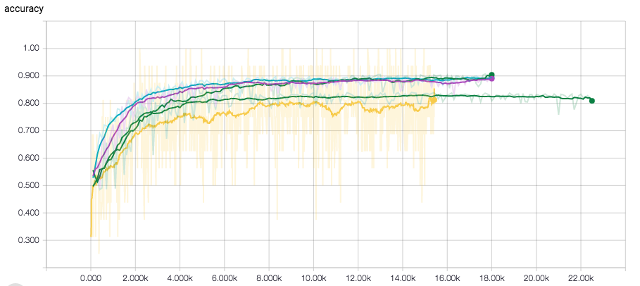
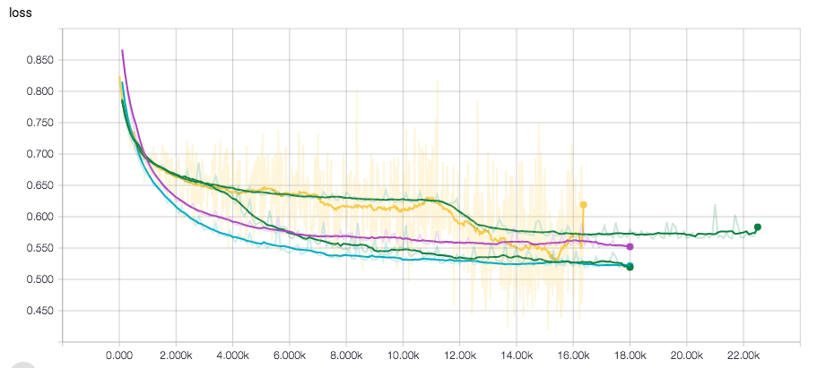

# Sentiment Analysis

## Dataset:

Dataset can be downloaded at http://ai.stanford.edu/˜amaas/data/sentiment/, and here I only use labeled data here. The original training set and testing set each contains 25,000 movie reviews, half negative and half positive. 
For data preparation, I collected all the positive and negative movie reviews from training data and to-
kenized all the words. Then I fed them into a vocabulary and selected the top 10k frequent words, discarded
the rest and labeled them as < oov >. Then for each of the sentence, I scanned it and indexed each of the
word according to the vocabulary. The vocabulary and matrixes of index for each of the sentence would be
fed into embedding layer for next step. 
For splitting, the training set has 24000 samples, and validation set has 1000 samples. For testing, I used
separate 25000 samples from testing data.

##model:
Here I implemented a FastText model which is proposed by Facebook. I implemented word embedding for the raw input with embedding size = 64, maximum sentence length = 300. For each of the sentence, the input size will be (300, 64). Then I used the average of
each of the columns in the matrix for every sentence. The output size of the embedding layer of the corpus
is a matrix with size=(25000, 64).
After embedding layer, I implemented a fully connected layer with multiple output nodes. After adding bias,
I used sigmoid for activation and added one dropout layer. This comes with the final layer with output size
= 2 classes.
For learning rate, although the MLP learning process doesn't overfit as severely as CNN, I added a decaying
learning rate with decaying to 0.96 after every 3000 steps.
For dropout, I added it after the fully connected layer with dropout keep prob = 0:8.
For optimization method, I tried Adam, Adadelta, Gradient Descent and listed the result as below in Table
1, where MSL stands for maximum sentence length. I used n-gram features for word embedding, here
n=2,3,4,5. And I found it works best when n=5. 
We can see that Adam Optimizer works best within 12 to 15 epochs, while Gradient Descent
and Adadelta converges more slowly.
After masking the padding sentence, the model worked better for longer features.

##Comparison:
The basic setting from FastText tool from Facebook gives a result of accuracy= 0.845, which is worse than
the model, but much faster. Setting the parameters to 5-gram and 30 epochs gives an accuracy = 0.85,
which is still worse than the model I implemented.

### Plot
- Here comes the figure to show accuracy and loss of different parameters in dev and test set. From the gures,
we can clearly see that accuracy starts to converge after 2500 steps. Models start to ovefit after 500 steps.
So there should be a compromise between accuracy and loss. 

