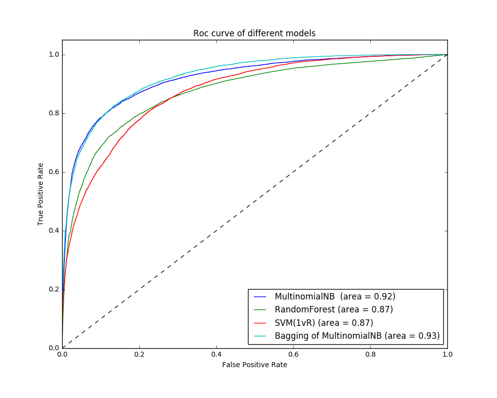

# Automated Question Answering System based on
Multiclass Prediction of Yahoo!Answers
Jiali Zhou, Jirou Xu, Lizhen Tan 

## Dataset:
The raw data is from Yahoo! Answers corpus as of
10/25/2007 in an xml file, which contains 4483032 questions
and their answers. 
 What’s the format of a question in the
dataset? A tipical question contains the following components:
(1) Subject of the question. (2) Optional content which
contains additional detail about the question. (3) The best
answer selected either by the asker or by the participants
through voting. (4) All answers posted for this question. (5)
Optional classification tags like main category, category and
subcategory. (6) The id of the user who asked the question.
(7) The id of user who provided the best answer. (8) The date
when the question was posted.

##task definition:
-The process of the project is divided into two stages. Stage
1: apply machine learning algorithms to predict the question
category based on Yahoo!Answers. The categories is a multiclass
classification problem. The input is a questions subject
and content, and we want the output to be a value of 0,1,2 or
3 indicating the categories of the questions.
An example of stage I input and output would be as follows:
Input: I havent seen Jen yet. I know her through her answers
only. What should I do?
Output: 2 (indicating the category is Society & Culture,
which corresponds to a predicted value of 2.)

-Stage 2: provide an answer to a question. First, use Stage 1s
model to predict the questions category. Next, we calculate the
similarities between the given question and all the questions
in the predicted category of the archive and find the question 
with the highest similarity score. After getting the highestscore
question, we can retrieve its associated best answer. This
best answer will be the output of the second stage. An example
of stage II would be as follows:
Input: is there anyway to get less pigment in ur eyes?
Output: ”Sorry your eye color is hereditary,make an appointment
with an optometrist and have him write you a Rx
for contact lenses.You can change your color with them and
you can wear them even if you don’t need to.”
Sections Data Preparation and Feature Extraction were steps
taken for Stage 1. Details of Stage 2 will be presented in the
Models and Experiments subsection Okapi BM25 Model.

##Discussion
In Stage 1, we have found that the random forest had
the lowest accuracy. By comparing the precision-recall curves
between random forest and SVM (OVA), we could easily see
that SVM (OVA) beat random forest for every class prediction.
This is also true for the other models when comparing with
random forest.
Usually, data scientists use Naive Bayes (NB) as the baseline
model for text analysis. So did we. We originally hoped
to get a general idea from the data by using multinomial NB,
however, after the parameter tuning process, multinomial NB
performed surprisingly well in our project setup. The reason
might be that, most text inputs in this problem are just short
sentences. Even with the content which give further description
of the question, the final input is still concise compared to long
documents, such that the strong independence assumption does
not hurt so bad in our case. We could even get a little bit most
boost by applying bagging the multinomial NB models.
From the inspiration of bagging the multinomial NB models,
we tried applying the same method, but the base models
for the new ensemble were all the trained models we have
obtained so far. However, it did not perform better than the
multinomial bagging model. A possible reason would be that the relatively degenerative random forest model dragged down
the performance.
Besides the performance of the models, we have noticed
that for each model, Computer & Internet was the hardest one
to get a correct prediction. When checking the entries in the
category, we found that a lot of questions refer to webpage
links and computer related proper nouns. Since the links are
not common words, it might bring a lot of confusion to model
training. Also, the computer-related proper nouns might be
assigned a little weight after we transfer them into lowercase
words.
In Stage 2, we have tried to check how similar a query (an
input question) to the corresponding similar question retrieval
from our self-built archive by the BM25 model by eye. We
found that most of the results were truly similar to the input
query, such as ’Anybody on the east coast who watched the
american idol finale who won was it Kat or Taylor’ and
’american idol who should win’. The model worked quite well
on finding the proper answer to the input query. However, we
also noticed that some queries did not have satisfying results
as well.
Queries being predicted into the category ’Society & Culture’
performed the worst. The reason might be that queries
in category ’Society & Culture’ tend to contain large quantity
of personal names and proper nouns, which will interfere
the calculation of BM25 score. Besides, one of the most
important disadvantages of this model is that the sentence
pattern matters too much. For instance, there are two queries
’What is the difference between A and B?’ and ’What is the
difference between C and D?’. The model will find that these
two questions to be most similar, even though C and D are
entirely different from A and B.
## Plot
- Here comes the figure to show roc curve from different models in test set. 

