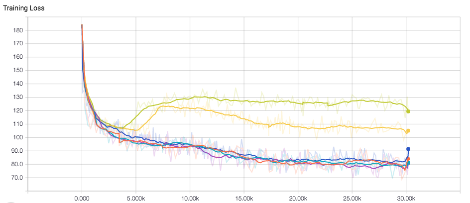
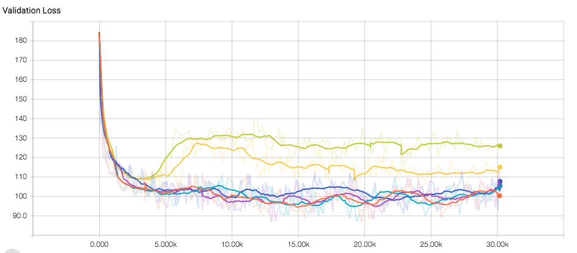
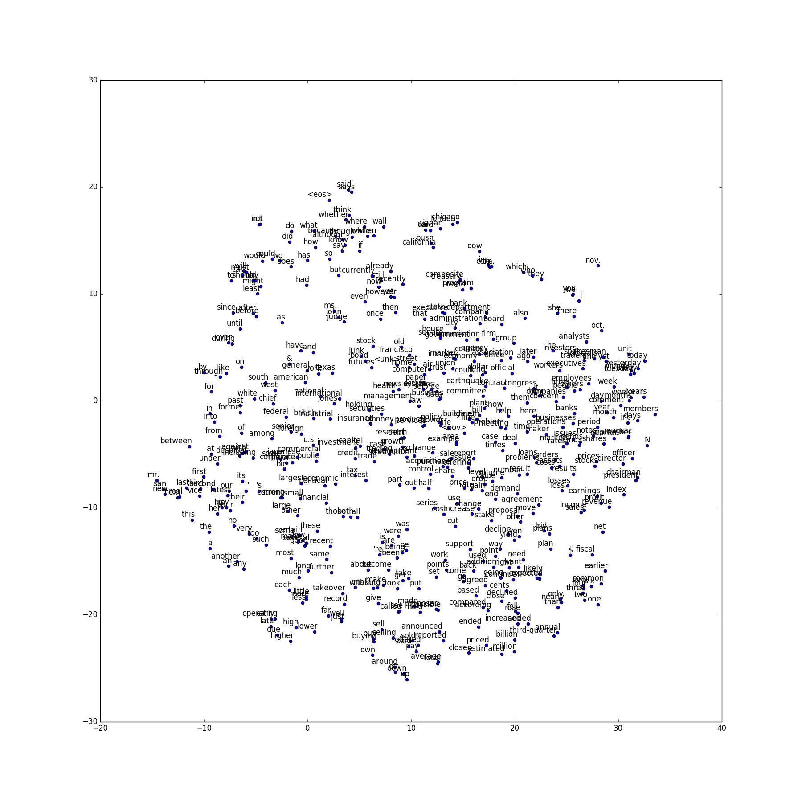

# Language Model

## Dataset:
The dataset is in the data directory of PTB dataset from Tomas Miklov's webpage. The dataset is already preprocessed and contains overall 10000 different words, including the end-ofsentence
marker and a special symbol (<unk>) for rare words. Here I convert all of them in the reader.py
to unique integer identifiers to make it easy for the neural network to process.

##model:
Here I implemented both GRU and LSTM model for predicting next word in the sentence. Using GRU instead of LSTM gives a faster model, the total time is 16963s, while the LSTM runs about 26131s. However, GRU gives a worse test result than LSTM. The test perplexity is 194.32. I guess this is because GRU doesn't have a memory state, and has less control
over the output.

## Plot
- Here comes the figure to show perplexity or loss from training and validation of different parameters in dev and test set. From the figures,we can clearly see that LSTM beats GRU after 5k steps. 

Here comes the figure that I used t-SNEndimension reduction algorithms for visualization of trained word vectors. The trick here is that "; " is not in the embeddings dictionary because all the training set have removed
"; ". I added "; " to dictionary and enlarges the length by 1. And I also plot the first 500 word vectors into
two-dimensional space using t-SNE. The result shows that similar words do cluster together. For example,
part and half, buy and sell, do and did.

