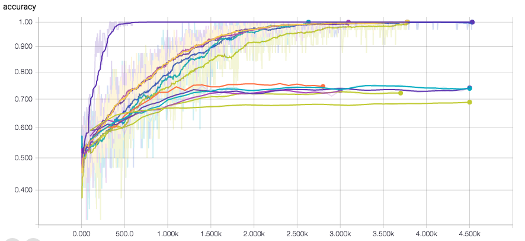
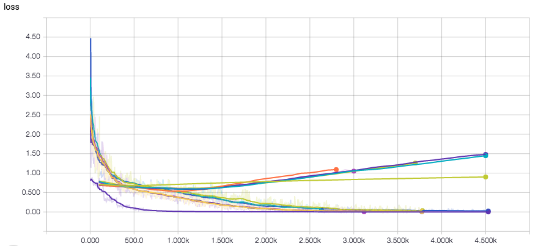

# Sentiment Analysis

## Dataset:

The dataset is the Movie Review data from Rotten Tomatoes. The dataset contains 10,662 example review sentences, half
positive and half negative. The dataset has a vocabulary of size around 20k. Also, the dataset does not
come with an official train/test split, so we simply use 10% of the data as a dev set. 

##model:
Here I implemented a convolutional nerual network with dropout probability 0.5, activation function of relu as it has the lowest loss and highest accuracy, early-stopping for regularization and achieved the best accuracy of 0.745.
### Plot
- Here comes the figure to show accuracy and loss of dierent parameters in dev and test set. From the gures,
we can clearly see that accuracy starts to converge after 2500 steps. Models start to ovefit after 500 steps.
So there should be a compromise between accuracy and loss. 

