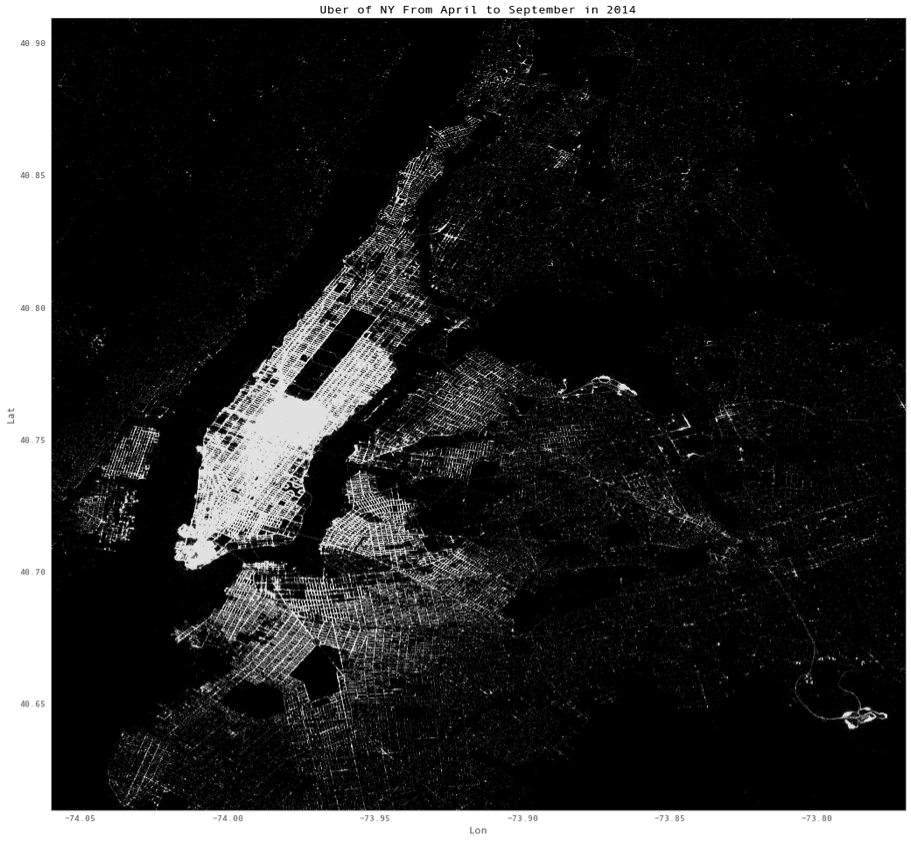
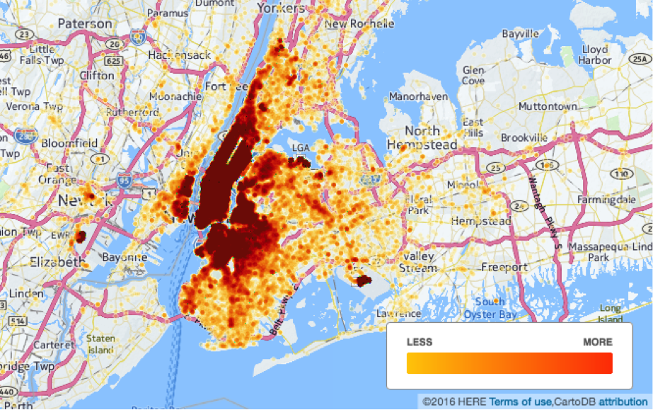
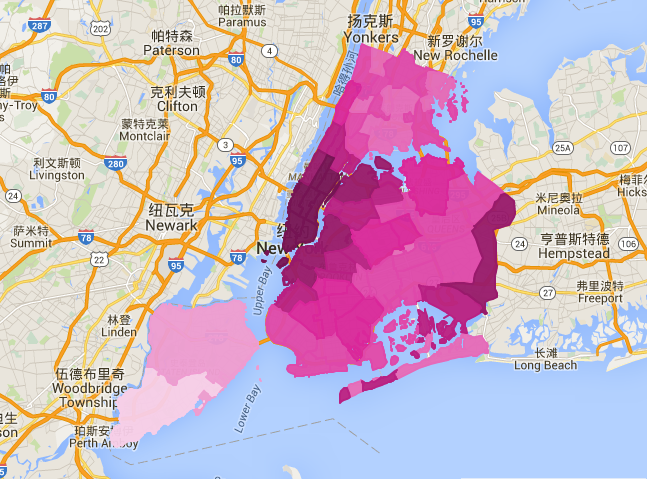
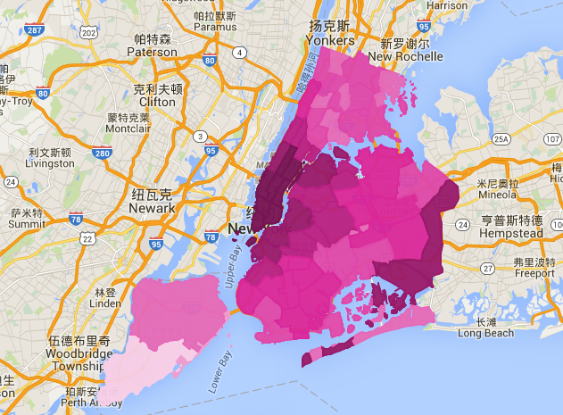
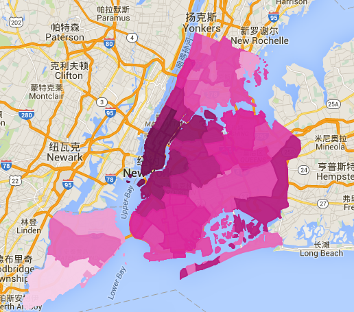
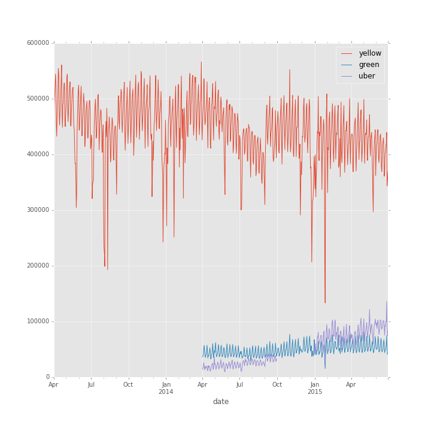

#Analysis of Interaction between 
Newly Introduced Taxi Modes and Yellow Taxi 
Jiali Zhou, N13930341, jz2312@nyu.edu 
Lizhen Tan, N12067584, lt911@nyu.edu 
Yu Shu, N18046060, ys2530@nyu.edu  

Google doc for final project report [link:](https://docs.google.com/document/d/1ss9v66gJ97DyzLCbaGTl2X3XFUHNTeJ45tf8akSjG-A/edit#)

## Introduction:

As a major trade center in the United States,  New York City’s convenient transportation is essential for people living in such a fast-paced lifestyle. Yellow taxi, a major means of transportation in NYC, has been widely used by people for many years. However, as new modes of transportation being introduced, such as green taxi and Uber, we wonder how yellow taxi is affected by them and what impacts have been brought to the urban movement by all of them. 

##Tasks:

Data collection and preparation
###Data sources:
Taxi data (yellow and green): http://www.nyc.gov/html/tlc/html/about/trip_record_data.shtml
Uber data: 
https://github.com/fivethirtyeight/Uber-tlc-foil-response

Interested time period for each mode of transportation:
Yellow taxi: 2013/04 - 2015-06 (Total size: 58G)
Green taxi: 2014/04 - 2015-06 ( Total size: 727M)
Uber: 2014/04-2014/09 and 2015/01 - 2015/06 (Total size: 3.4G)

county_latlong_extract.py looks for boundary lat-long for counties in NYC

Cleanup folder is the very first step, after this cleanup, any next steps is based on
the output of this cleanup.

county_pickup_count: find pickup count for any county in NYC

pickup_daycount: find daily pickup count 

seasonal_pickup_lat_long: find lat-long for a specified year (groupby seasons)

###Data Analysis and Visualization:
First let’s take a look at green taxi pickup counts in June, 2014. Fig below shows the extent to which area the green taxi has served. The deeper color the area is, the more pickups the green taxi has. From the map we can see that there is few pickups in downtown Manhattan. And the activities focus in the regions of Bronx, Brooklyn and Queens. Comparing the map of June 2014 with June 2015, we can see that Green taxis serve underserved regions in Brooklyn more than before.

Then, we can take a look at the distribution map of Uber pickup counts in New York city from April 2014 to September 2014 below. We summed up all the counts together for each point of latitude and longitude and used python to draw a scatter plot of the Uber pickup activities. [This chosen time period is limited by data missing from October 2014 to December 2014; and the other set data from January 2015 to June 2015 data have only locationID information but not lat-long information. Here the brighter the region is, the more pickups activities there are. This map shows that there are more Uber activities in manhattan than in other parts of New York. 

Next, we can take a look at the heatmap of the situation of yellow taxi pickup counts in New York city above. This heatmap shows that there were more taxi activities in manhattan and brooklyn than in other parts of New York (in 2014).

Then let’s look at the maps of yellow taxi in June 2014 and August 2014. 

We can see that there is a decrease of pickup counts of yellow taxi in part of the areas in Staten Island, Bronx and Brooklyn. The areas where show a decrease of yellow taxi pickups overlaps with the areas where show an increase of Uber taxi pickups, which illustrates that Uber has negatively affects revenues for taxi. 

And the map below shows the yellow taxi pickup situation in September, 2014. 

We can see there is a slightly increase in part of the regions of Bronx and Brooklyn, which coincides with the decrease of Uber from August 2014 to September 2014. This coincidence can help prove the competition relationship between yellow taxi and uber, as the area where taxi counts got an increase overlapped with the area where uber counts got an decrease.

Fig below has show the statistics of daily pickup counts for yellow taxi, green taxi and Uber in the time period from April 2014 to July 2015.  

From there,  we can see that the yellow pickup counts decreased obviously from  April 2015 because of the introduction of Uber program in April 2014 and the continuously increasing tendency of green taxi in underserved regions such as Brooklyn. 
As for the choice of transportation, we have done a little survey among some of our International school mates. The result has reflected that, when they first came to New York, they would like to take taxis. However, as they get more and more familiar with this city, this habit has changed. Nowadays, most people would prefer taking out their phones and then get a cab service through the Uber app. This has shown that among younger generations, Uber is a prior choice over taxis. This is also evidently proved by the fact that count of Uber pickups in NYC  grew by 606.5% between Apr 2014 and June 2015, while the yellow taxi declined by 24.6% over the same period.Uber made 86 thousand more pickups on July 30, 2015 than April 1, 2014 in NYC while yellow taxi made 112 thousand pickups. Although the yellow taxi total amount of pickups is still more than twice than Uber, Uber has increased dramatically in a very short period. In addition to this, Uber amounts was rapidly approaching the green taxi before 2015 and exceeded the green taxi amounts in 2015.

###Technologies used in this project:

Data related: hadoop, mapreduce, python, javascript.
Maps and charts: Google map api, d3, plotly, tableau, cartoDB.

single_day_for_specific_spot: look for the count for a specific regiion
